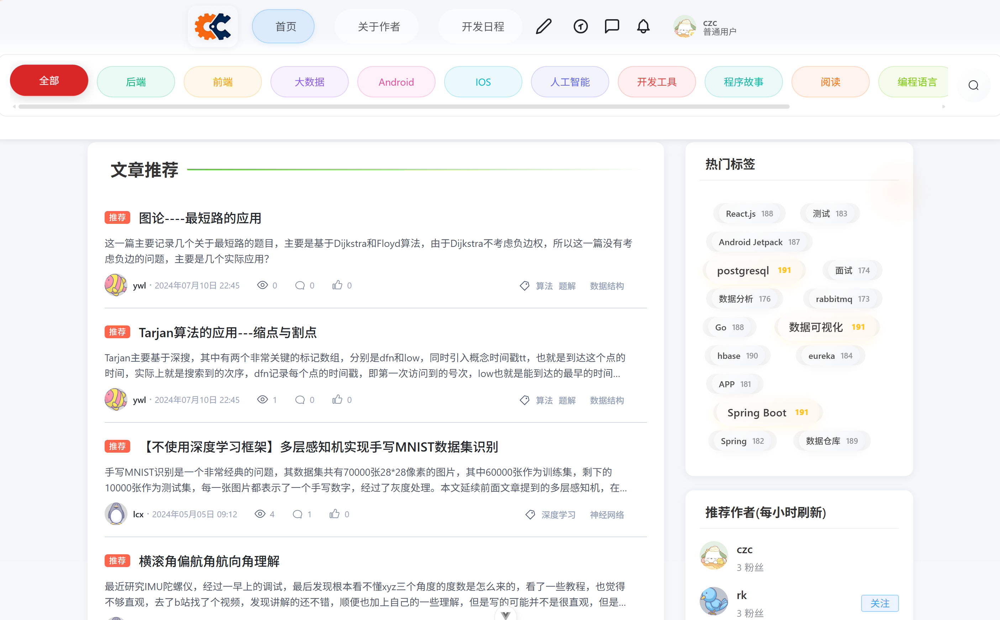
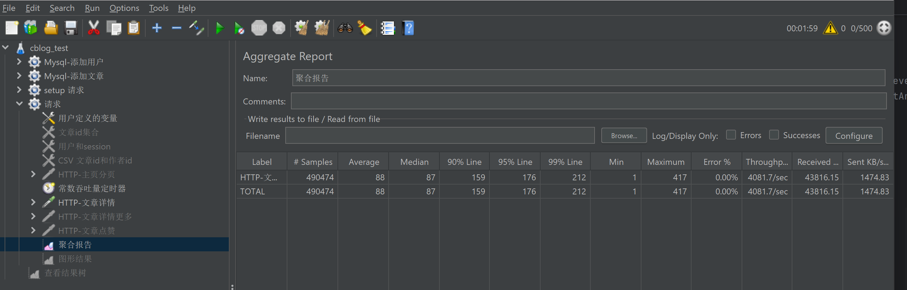
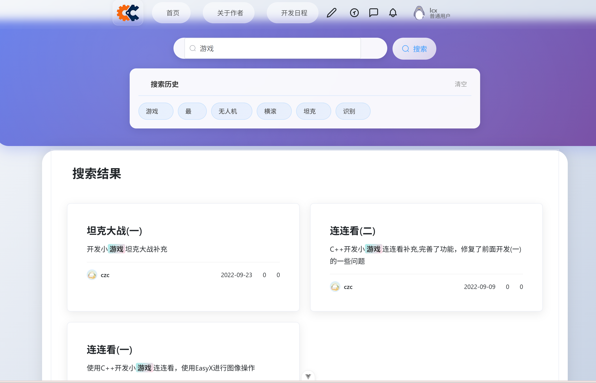
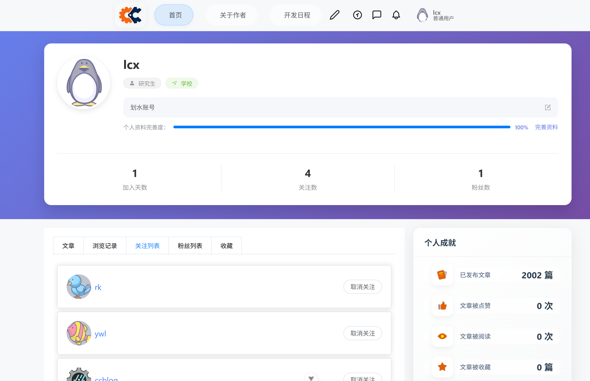
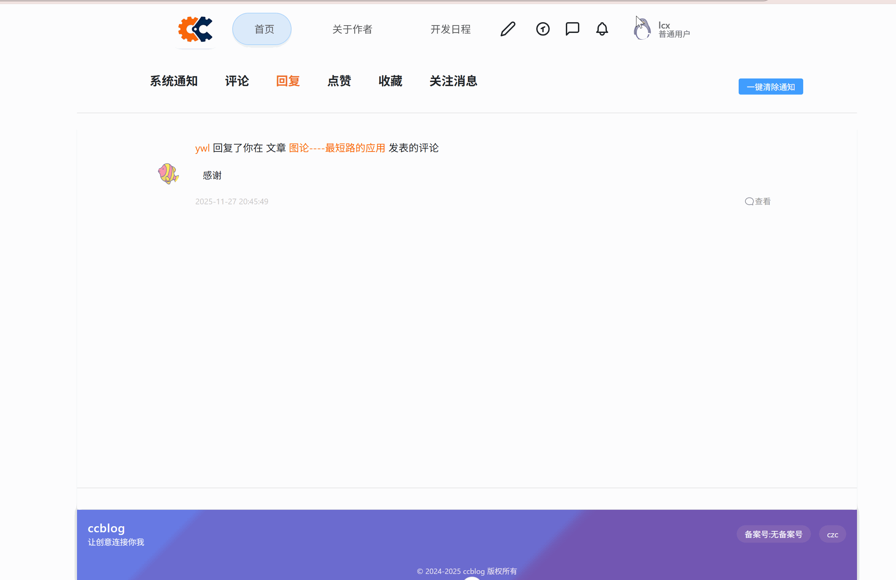
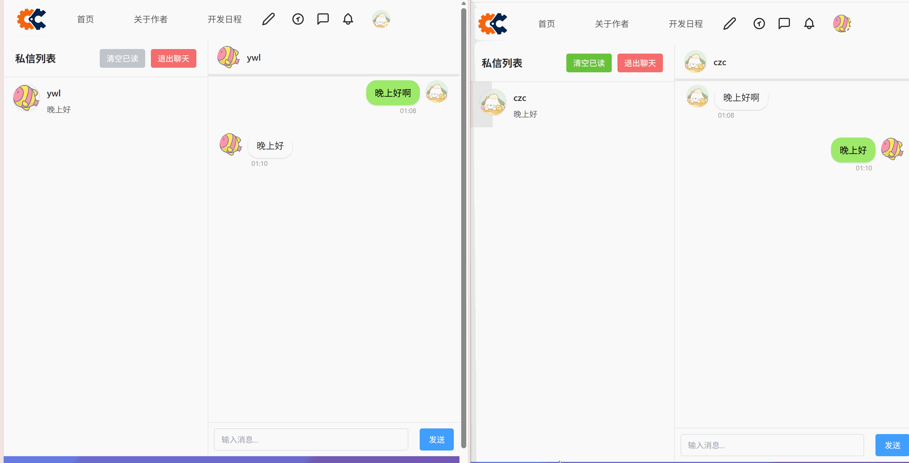
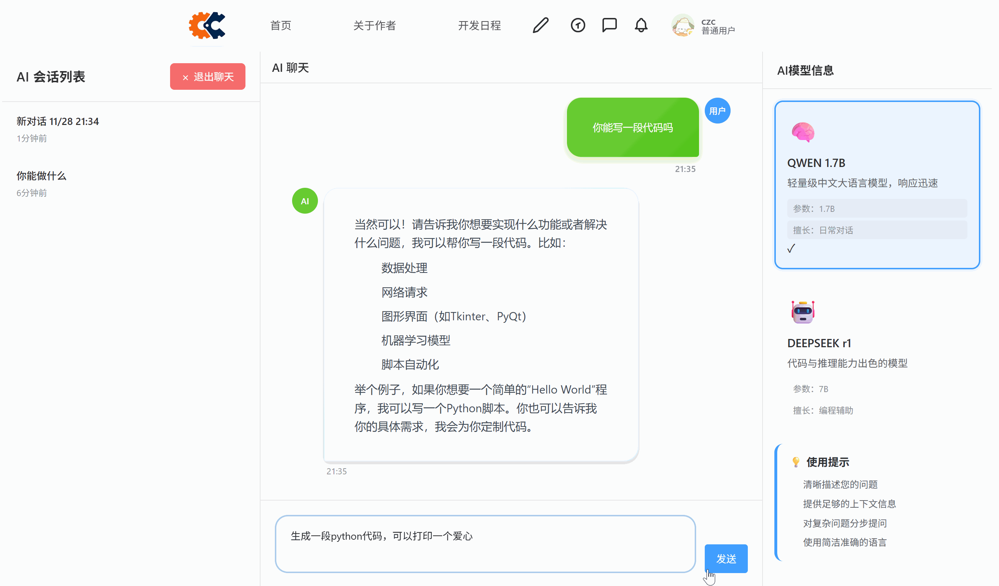
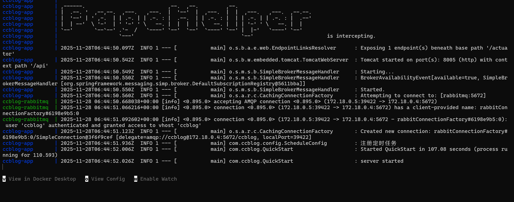

# CCBlog

**高性能博客模板，涵盖主流技术栈Springboot+Mybatis+RabbitMQ+Redis+Caffeine+Mysql，实测500并发4000QPS，双层缓存+异步聚合，一键Docker运行！**




# 项目介绍

本项目是一个中等并发的博客项目，采用前后端分离架构开发，基本实现博客所有相关的功能，**该项目也可作为内容社区**的模板。项目包括五大模块分别是**用户、文章、评论、通知、聊天模块**。

本项目采用项目[技术派](https://github.com/itwanger/paicoding/tree/springboot3%26vue3)作为脚手架，参考了前端架构和后端鉴权部分，**后端所有核心模块均为独立自主开发**，非常感谢作者开源代码参考学习。

**项目亮点**：

1. 文章、评论通知聊天的计数以及各种内容落库采用**Reids+Rabbitmq双阈值聚合批量异步落库**，使用**Disruptor队列+分片批量聚合架构**对高频读写的文章详情接口进行了优化，并使用异步操作进一步优化性能。
2. 评论实现采用**无限层级游标评论树**，支持点赞点踩回复功能，并且**可从通知消息中跳转，置顶渲染目标评论的顶级评论，并展开到目标评论**。
3. 采用**Websocket实现双人实时聊天**，实现了**撤回、删除、置顶会话**等常用功能，**实时更新会话预览**。**调用大模型接口实现AI大模型聊天**并使用**SSE流式渲染**。
4. 整体后端缓存结构为**Caffeine+Redis的双层缓存架构**，对于高频访问接口（文章详情、博客首页等都覆盖了本地缓存），并且对于评论、首页的Caffeine缓存**设定了索引保证双写一致**。 
5. 大规模**使用批量操作Redis和Mysql，压缩通信RTT时长**，并使用**LUA脚本优化带记忆状态**的Redis读写，极大提高数据库并发性能。

项目核心优化接口为**文章详情接口**，该接口为**核心流量入口**，并且涉及用户阅读状态、文章阅读量的落库，读写压力极大。实测在**500并发的测试环境下取得了4000QPS，0 Error**的成绩。



> 注：测试环境为10000篇文章，1000用户，测试前进行缓存预热，每篇文章Payload约为1.5KB。


# 技术栈


| 功能/模块 | 技术/框架          | 说明                   |
| ---------- | ------------------ | --------------------------- |
| 框架       | Spring Boot        | 3.x                         |
| 构建工具 | Maven | 项目管理 |
| 数据访问   | MyBatis            | 采用Mybaitis查询数据库      |
| 缓存       | Redis 7 + Caffeine | 双层缓存架构                |
| 消息队列   | RabbitMQ 3.12      | 批量异步聚合                |
| 高性能队列 | Disruptor          | 聚合落库                |
| 读写增强 | Lua | 批量Redis读写 |
| 数据库     | MySQL 8.0          | utf8mb4 + ngram 全文索引    |
| 通信       | WebSocket          | 双人实时聊天 + SSE 流式渲染 |
| AI 接口    | 大模型&HTTP-SSE | SSE流式返回              |
| 前端主体 | Vue 3 + Vite      | 组合式 API + TypeScript |
| UI 框架  | Element Plus      | 组件库                  |
| 状态管理 | Pinia             | 类型安全                |
| 网络请求 | Axios             | 拦截器统一处理          |
| 实时通信 | SockJS + Stomp.js | WebSocket 封装          |
| 容器化      | Docker + Docker Compose | 一键本地/服务器部署    |
| 反向代理    | Nginx Alpine            | 静态资源 + API 转发    |
| 性能压测    | JMeter                  | 实测 500 并发 4000 QPS |


# 项目结构


项目文件结构

```
repo/
|-- ccblog-front            前端服务，Vue3
|-- doc                     项目文档
|-- ccblog-docker           项目docker运行文件
  |-- dist                  
  |-- service               项目代码，存放jar
  |-- nginx                 nginx代理配置
  |-- rabbitmq              rabbbitmq相关，存放初始化配置
  |-- mysql                 mysql相关，存放初始化配置
  |-- run.sh                linux下的运行脚本
  |-- docker-compose.yml    镜像配置文档
|-- ccblog-server           后端服务，使用Jdk17
  |-- ccblog-common         工具层，依赖pojo
    ..
    |-- com.ccblog
      |-- constant          常量定义
      |-- exception         异常
      |-- template          抽象类/接口模板
      |-- utils             工具类    
  |-- ccblog-pojo	        数据层
    ..
    |-- com.ccblog
      |-- cfg               配置数据类
      |-- dto               视图数据类
      |-- entity            实体数据类
      |-- enumeration       枚举数据类
      |-- event             事件数据类,包括异步事件、聚合事件...
      |-- vo                前端通信类
  |-- ccblog-service        服务层,依赖common,pojo
    ..
    |-- com.ccblog
      |-- aspect            切面服务类
      |-- concrrentCache    Map缓存类,主要存储数据量小且读多写少(类别,标签)
      |-- config            初始化服务
      |-- controller        接口服务
      |-- dseruptor         Disruptor队列服务
      |-- localCache        本地缓存服务(主要为Caffeine)
      |-- mapper            数据库操作服务
      |-- mq                消息队列服务(主要为RabbitMQ)
      |-- redis             redis缓存服务
      |-- service           实现类
      |-- QuickStart      ← 服务器入口
```


# 界面展示

项目整体采用活泼可爱的界面和交互，操作体验好。

---

**搜索简易实现**



---

**用户主页**



---

**通知跳转评论置顶渲染**



**实时聊天实时预览渲染，支持删除撤回**（使用两个浏览器同时发送得到）



**大模型对话**，后续会更新加入更多模型。




# 快速开始

本项目已在Win环境、Ubuntu环境运行成功，并提供Docker镜像，下面为docker运行步骤。

**docker镜像已在Win / Ubuntu22.04 / Ubuntu20.04测试通过。**

如果为win系统，先下载 [Docker Desktop](https://www.docker.com/) 并打开，如果是linux，那么先下载并配置好docker环境。

然后下载项目并启动服务器

```
git clone https://github.com/C2Z666/ccblog.git
cd ccblog/ccblog-docker
docker compose up
```

初次需要下载镜像，共五个镜像，大约1G，下载完成会自动启动服务器，包括前端和后端和中间件，服务器启动成功应该可以看到如下内容（初次会初始化数据库，这会消耗一段时间）：



成功后到浏览器输入`localhost:8080`就可以访问啦！

> 注意：
>
> 1.默认没有配置大模型聊天和文件上传（头像上传），其他功能正常。
>
> 2.如果在启动过程中卡在rabbitmq或者其他某个进程不动，可能是遇到端口占用问题，请手动解决。若在两   个平台同时运行，请注意同一台主机会共享同样的端口。
>
> 3.mac系统没有测试过，不知道实际情况。

输入下面指令关闭：

```bash
docker compose down
```

在linux下提供了`run.sh`快捷运行方式，使用方法如下：

```bash
sudo chmod +x run.sh
./run.sh
```

---

若要更加深入了解该项目，或者使用源码运行，可参考[运行文档](./doc/运行配置.md)

同时在doc目录下还提供了其他文档，包括：

[数据库文档](./doc/数据库设计.md)


# 写在最后

该项目是我在学习了Java之后写的第一个项目，大约耗时600h，**全部独立完成**。

个人的水平和精力有限，项目的有些地方尚不成熟，部分模块未重构完毕，后续会继续完善，包括修复bug、完善架构、加入新功能等。

目前已知该项目存在下面一些问题：

1. 比如接口定义什么不规范，代码风格就更不用说了，很多已经被ai加的乱七八糟了。
2. 后端的数据类定义存在一些历史遗留问题（比如有些收藏还是用的star），并且和前端的传输没有定义为Vo，不算严谨
3. 异常系统不完善
4. RedisUtil写的太乱了，最好是分开不用类别存放
5. 有些地方重复写没有抽象的很好
6. hash 类型redis的field定义比较乱，还没有特别好的规范。
7. 热门关注模块只要显示实时粉丝，就一定会出现用户点了关注刷新后不对，除非用户有k/w级体量，那么那样可以忽略变化（一般正常博客网站一定会有这样的体量），也就是用户点了其实不会实时反馈精确变化，可以容忍一定滞后
8. 日志系统不完善，严格来说是还没加入
9. 后续有时间会考虑做管理端

最后，**欢迎经验丰富的大佬指导架构设计，志同道合的朋友一起学习交流**，作者会虚心求教的。

也欢迎大家将测试的问题反馈给我，问题的过程和环境都尽量详细一点，我会尽快给出反馈（能修的情况下😂）。


