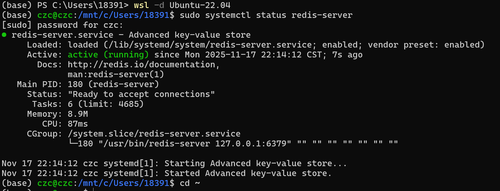
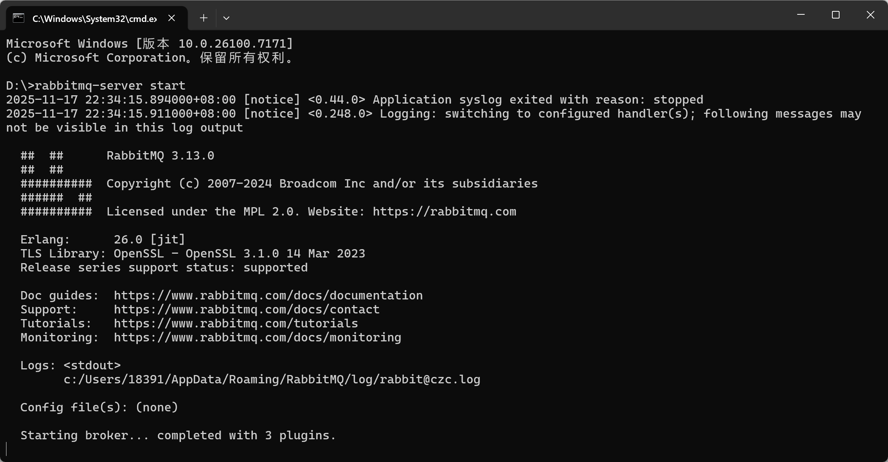
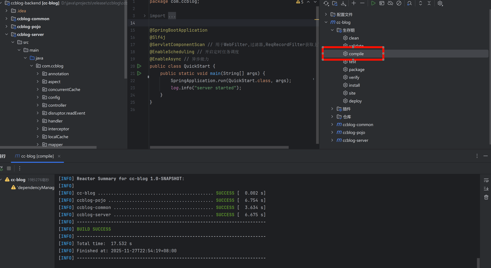
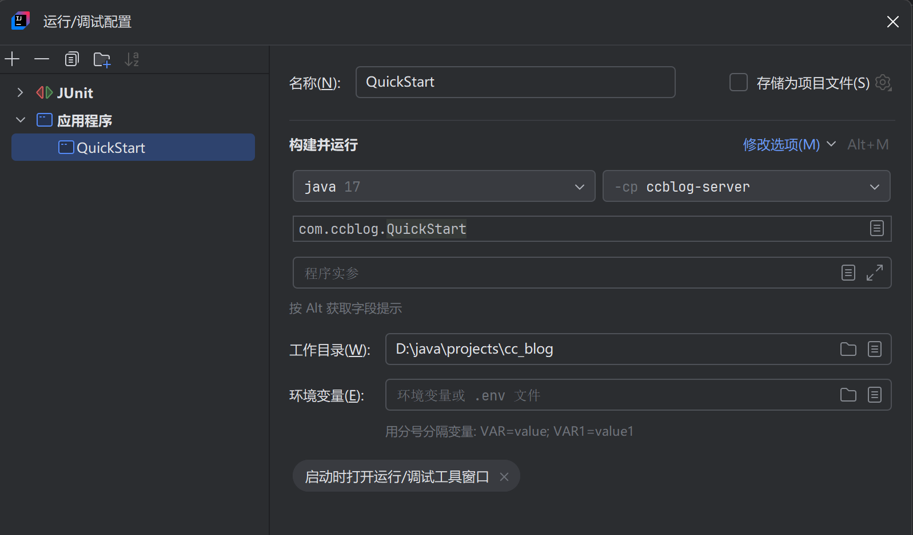
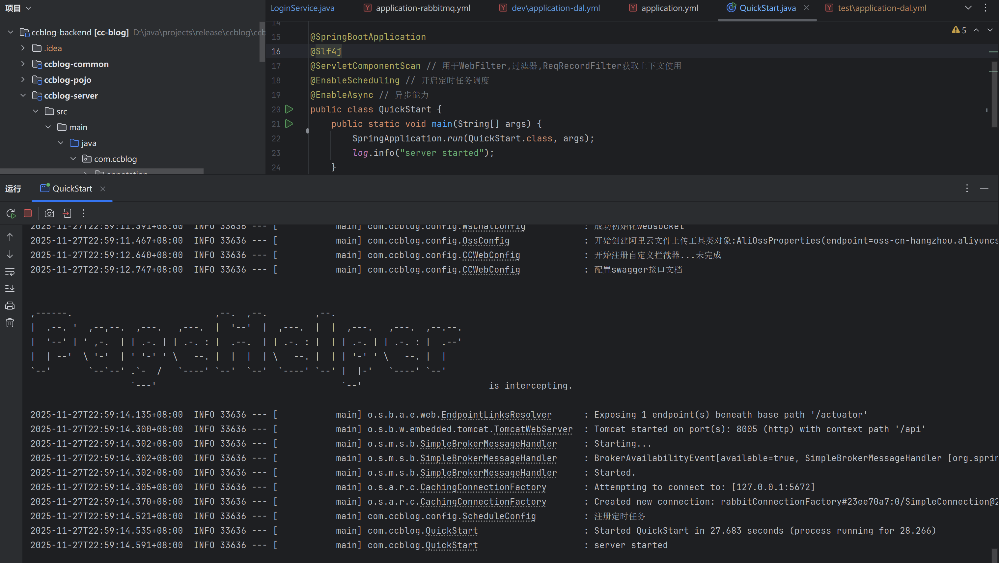
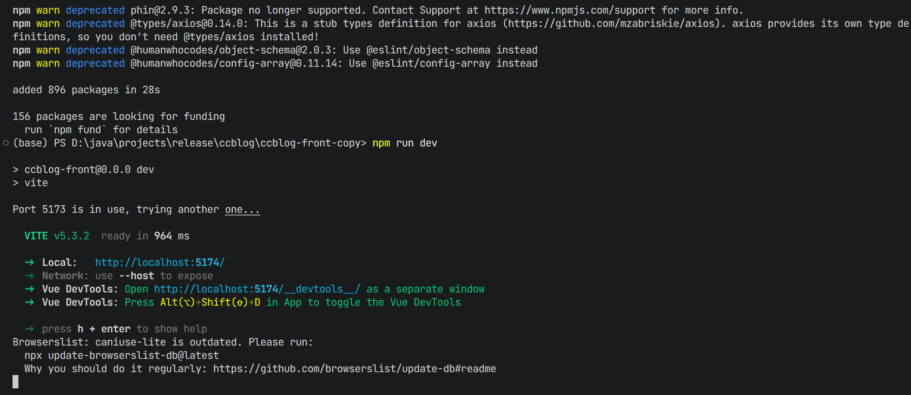

# 中间件配置

如果不想配置麻烦的中间件，想要快速体验，请使用[Docker运行](../README.md)，参考`快速开始`模块。

如果使用镜像，那么需要安装所需的中间件。如果在Win下运行，安装Win下的Mysql和RabbitMQ即可，Redis比较特殊必须要安装linux版本的，否则会出现版本冲突问题（实测Redis 8.\*有问题，Redis 7.\*没有找到win下可用的，6.*没有测试过，不知道能不能匹配Redisson3.23.4，或者可以尝试降低Redission版本）。


## Redis

在window下用wsl用linux比较方便，如果不想用用虚拟机应该也是一样，下面以wsl为例，过程都是实测装机。

### 安装(ubuntu 20.04)

**个人推荐ubuntu22**，因为后续都是用的22，20没有测试过。ubuntu22看[下面](#安装(ubuntu 22.04))。

如果是使用WSL，先按照[教程](https://blog.csdn.net/Natsuago/article/details/145594631) 安装好ubuntu，然后在powershell启动系统：

```bash
wsl -d Ubuntu-20.04
```

如果有redis运行先停止：

```bash
sudo systemctl stop redis-server
```

卸载旧版本：（新安装的环境不用管）

```bash
sudo apt remove --purge redis-server redis-tools -y
```

添加源：

```bash
curl -fsSL https://packages.redis.io/gpg | sudo gpg --dearmor -o /usr/share/keyrings/redis-archive-keyring.gpg
echo "deb [signed-by=/usr/share/keyrings/redis-archive-keyring.gpg] https://packages.redis.io/deb $(lsb_release -cs) main" \
  | sudo tee /etc/apt/sources.list.d/redis.list
sudo apt update
```

安装

```bash
sudo apt install \
  redis-server=6:7.0.15-1rl1~focal1 \
  redis-tools=6:7.0.15-1rl1~focal1
```

查看版本：

```bash
redis-server --version
```

出现`Redis server v=7.0.15 sha=00000000:0 malloc=jemalloc-5.2.1 bits=64 build=3135c69f59ee4790`。


### 安装(ubuntu 22.04)

Ubuntu20.04可以跳过了。

```bash
sudo add-apt-repository ppa:redislabs/redis -y
sudo apt update
sudo apt install redis-server
redis-server -v 
sudo systemctl enable --now redis-server
```

版本：`Redis server v=7.4.1 sha=00000000:0 malloc=jemalloc-5.3.0 bits=64 build=9c49f1816fd80301`。


### 配置

配置密码：

```bash
sudo vim /etc/redis/redis.conf
```

找个地方加上`requirepass 123`。（我没找到对应位置直接加在第一行了）

在powershell执行防火墙放行

```bash
New-NetFirewallRule -DisplayName "Allow-WSL-Redis" `
  -Direction Inbound -Protocol TCP -LocalPort 6379 -Action Allow
```

在` %USERPROFILE% `（在windows文件地址栏输入这个）路径下面创建一个.wslconfig，写入：

```
[wsl2]
memory=4GB          # 按内存大小调
swap=0
localhostForwarding=true
```

这个好像跟地址有关。（目前不清楚）


### 使用

启动redis

```bash
sudo systemctl start redis-server
```

看是否在跑：看 Active: active (running)）

```bash
sudo systemctl status redis-server
```

如下：



测试能否联通：

```bash
redis-cli -h 127.0.0.1 -p 6379 -a 密码 ping 
redis-cli -h 127.0.0.1 -p 6379 -a 123 ping 
```

看到PONG就是成功了。

停止服务：

```bash
sudo systemctl stop redis-server
```


## RabbitMQ

### 安装(win)

我安装的是Erlang 26和RabbitMQ 3.13，一开始安装的`3.12.10 beta`版本有bug。

可以参考[教程]( [最新windows版本erlang26.0和rabbitmq3.13下载_erlang26下载-CSDN博客](https://blog.csdn.net/weixin_39311781/article/details/138189090) )，我没有实测过，当时看的链接找不到了。

> 注意**rabbitmq的路径不能有中文**

然后添加环境变量，把sbin的目录加到path。

执行：

```bash
rabbitmq-plugins enable rabbitmq_management 
```

输入下面指令启动服务，注意不要跟service搞混了：（直接到目录下面点击也可以）

```bash
rabbitmq-server start
```



之后在`http://localhost:15672`可以查看管理端，默认账号密码都是`guest`。


### 安装(ubuntu 22.04)

先安装erlang26，我直接到[官网]( [Erlang and Elixir Packages Download - Erlang Solutions](https://www.erlang-solutions.com/downloads-2/#)) 下载了deb文件，然后直接安装。（jammy表示ubuntu22，如果是其他版本用对应的）

```bash
sudo dpkg -i esl-erlang_26.0-1~ubuntu~jammy_amd64.deb
sudo apt -f install 
```

进入erl在终端输入命令，查看版本

```bash
erl
1> erlang:system_info(otp_release).
quit
```

输出26就是对的

rabbitmq类似，直接到[官网]( [Release RabbitMQ 3.13.0 · rabbitmq/rabbitmq-server](https://github.com/rabbitmq/rabbitmq-server/releases/tag/v3.13.0) )下载，直接安装

```bash
sudo dpkg -i rabbitmq-server_3.13.0-1_all.deb
sudo apt -f install 
```

查看版本

```bash
sudo rabbitmqctl version
```

输出3.13.0就是对的。

启动web服务

```bash
sudo rabbitmq-plugins enable rabbitmq_management
```

加用户给权限：

```bash
sudo rabbitmqctl add_user 用户 密码
sudo rabbitmqctl set_user_tags 用户 administrator
sudo rabbitmqctl set_permissions -p / 用户 ".*" ".*" ".*"
```

添加虚拟主机(这部分是需要写在配置的vitural host，看自己)

```bash
sudo rabbitmqctl add_vhost 虚拟主机名称
sudo rabbitmqctl set_permissions -p 虚拟主机名称 用户名 ".*" ".*" ".*"
```

启动

```bash
sudo systemctl start rabbitmq-server
```

查看状态

```bash
sudo systemctl status rabbitmq-server
```


## Mysql

### 安装(win)

我装的版本是`8.0.43`，这个教程很多，随便找一个就可以。

找到mysqld加上：

```ini
# The following options will be read by the MySQL Server. Make sure that
# you have installed the server correctly (see above) so it reads this 
# file.
#
[mysqld]
default-time_zone='+8:00' # 中国时间
ngram_token_size = 1      # 分词大小
```

需要启动服务，可以在服务里面打开，也可以通过命令行打开。


### 安装(ubuntu 22.04)

下载并更新

```bash
wget https://dev.mysql.com/get/mysql-apt-config_0.8.29-1_all.deb
sudo dpkg -i mysql-apt-config_0.8.29-1_all.deb   # 弹出界面直接 OK/OK
sudo apt update
sudo apt install -y mysql-server
```

加固安全，我在下面基本都选了yes，看个人

```bash
sudo systemctl enable --now mysql
sudo mysql_secure_installation   # 按提示设置 root 密码、移除匿名用户等
```

进入mysql

```bash
sudo mysql -uroot -p
```

添加用户root（看自己）

```bash
CREATE USER 'root'@'%' IDENTIFIED WITH mysql_native_password BY '你的密码';
```

赋权

```bash
GRANT ALL PRIVILEGES ON *.* TO 'root'@'%' WITH GRANT OPTION;
FLUSH PRIVILEGES;
```

输入`quit`退出

改配置

```bash
sudo vim /etc/mysql/mysql.conf.d/mysqld.cnf
```

并且加入：

```ini
[mysqld]
#
# * Basic Settings
#
user            = mysql
# pid-file      = /var/run/mysqld/mysqld.pid
# socket        = /var/run/mysqld/mysqld.sock
# port          = 3306
# datadir       = /var/lib/mysql
# 加入下面的
default-time_zone='+8:00' # 中国时间
ngram_token_size = 1      # 分词大小
```

并且：

```bash
# 注释掉允许其他主机连接
# bind-address          = 127.0.0.1
```

重启

```bash
sudo systemctl restart mysql
```


# 运行（Win）

在**启动服务器之前要启动所有需要的中间件，包括Redis、RabbitMQ、Mysql**。可以单独一个个开启，也可以用下面的快捷方式。

## 一键打开中间件

一键配置针对Mysql和RabbitMQ都在Win系统中（假设有符合条件的Redis在也可以），可以一键`.bat`启动服务，省去繁琐启动步骤：

```bat
@echo off
title 一键启动MySQL+Redis+RabbitMQ

:: MySQL
echo Starting MySQL ...
start "MySQL-Window" /D "D:\documents\mysql\mysql8\bin" cmd /k mysqld --console

# :: Redis(如果可用)
# echo Starting Redis ...
# start "Redis-Window" /D "D:\java\redis-windows-Redis7.0" cmd /k redis-server.exe redis-windows.conf

:: RabbitMQ（独立窗口）
echo Starting RabbitMQ ...
start "RabbitMQ-Window" /D "D:\java\rabbitmq-server-windows-3.13.0\rabbitmq_server-3.13.0\sbin" cmd /k rabbitmq-server.bat
```

**注意把里面路径改为你的实际路径，然后保存为XXX.bat，之后点击就可以启动里面涉及的内容了**

**默认Redis用linux中的**，可以参考[redis配置和开启](#安装(ubuntu 22.04))。

如果是使用WSL，实测发现的问题是如果已经打开了powershell或者cmd窗口，点击后会白屏没有反应，所以建议顺序是先启动这个，然后启动redis。

> 参考方案：(实测有用)
> 打开 **WSL 侧**的 `/etc/wsl.conf`（没有就新建）： 
>
> ```ini
> [interop]
> enabled=true
> appendWindowsPath=true
> 
> [automount]
> enabled=true
> mountFsTab=false
> # 关键：禁止 WSL 把 Linux 颜色表写进 conhost
> [system]
> forceWindowsConsoleColor=false
> ```
>
> 

## 后端服务器

---

jdk：开发版本为`jdk17`，用`jdk8`似乎会报错。

IDE：IDEA，这个看个人喜好。 

项目管理工具：Maven，先安装好Maven。（没记错的话Maven是IDEA自带的）

---

首先写好所有配置，包括**Redis配置（必填）、Mysql配置（必填）、RabbitMQ配置（必填）**、OSS配置（选填）、大模型配置（选填），这些文件在`ccblog-server/src/main/resources-env/dev`，默认端口是8005，在`application.yml`里面，也可以换成其他未被占用的。

然后先使用Maven编译代码，印象中会自动配置相关依赖，编译成功后进入下一步。



点开`ccblog-server/src/main/java/com/ccblog/QuickStart.java`，这个是程序主入口。

如果是旧版本IDEA（比如2021版），那么直接点击运行即可。

打开如果是使用的新版本IDEA，在QuickStart的界面点击运行，但是在其他界面不可以。

如果不想每次都到QuickStart，那么需要配置运行文件，点击运行旁边的当前文件，进入编辑配置，然后添加新配置，选择应用程序，名称随便，然后右边的构建选择jdk17，并且-cp选择ccblog-server，在下面输入`com.ccblog.QuickStart`，点击应用，然后后续直接运行这个就可以了。



然后点击运行即可。

运行后可以看到初始化过程，第一次会对redis和数据库进行初始化，并且查看MQ管理端，会看到新的mq队列：

运行成功如下：



后端服务器到这里启动完毕。

> **注意**，项目目前支持阿里oss和讯飞大模型对话，OSS和大模型接口配置这两个不填不影响主体功能，但是如果需要使用更换头像、大模型对话等相关功能那么需要配置，否则无法正常使用！


## 前端服务器

前端服务器采用Vite构建，需要提前配置好Nodejs，可以参考 [Node.js | npm下载安装及环境配置教程](https://zhuanlan.zhihu.com/p/7314838716) ，这个我没验证过，印象中不难配置。

进入项目，打开终端，下载依赖：（这个只需要执行一次）

```bash
npm install 
```

然后直接运行

```bash
npm run dev
```

会看到端口信息，然后就在浏览器访问了。




## 访问

打开浏览器，输入默认地址：`http://localhost:5174/`，或者直接ctrl+`前端打印出的Local：链接`跳转，可以看到CCblog的主页。

不出意外，系统会自动生成五个账号，分别是`czc、lcx、ywl、rk、ccblog`，密码都是`123`，可以在界面直接登录使用了，当然也可以注册一个，非常简单。


# 运行（Ubuntu）

下面是在Ubuntu运行的流程，以ubuntu 22.04为例，最终运行在本机的Ubuntu。（没有到外网）

## 一键打开中间件

首先在本机Ubuntu安装好中间件，创建`quick_open.sh`，写入下面。

```bash
#!/usr/bin/env bash
# quick-start.sh : 一键启动 Redis + RabbitMQ + MySQL
set -e

SERVICES=(redis rabbitmq-server mysql)

# 1. 启动服务
for srv in "${SERVICES[@]}"; do
    echo ">>> Starting $srv ..."
    sudo systemctl start "$srv"
done

# 2. 等待端口就绪
for port in 6379 5672 3306; do
    until nc -z 127.0.0.1 $port >/dev/null 2>&1; do
        echo "   Port $port not ready, wait 1s ..."
        sleep 1
    done
    echo "   Port $port OK"
done

# 3. 打印版本
echo
echo "=== Versions(redis|rabbitmq|mysql)==="
redis-server --version | head -n1
sudo rabbitmqctl version
mysql --version

echo
echo "All services are up! (Redis:6379  RabbitMQ:5672/15672  MySQL:3306)"
```
改为可执行：
```bash
sudo chmod +x ./quick_run.sh
```

执行：

```bash
./quick_run.sh
```


## 前端服务器

这部分可以作为部署到云服务器的一个练习。

开发环境使用的是Vite服务器，但是一般在linux都是部署和生产了，不会再用vite，所以前端服务器需要用Nginx进行反向代理。

在vite里面输入：

```bash
npm run build
```

然后会得到一个dist文件夹，把这个文件夹复制到Ubuntu，要记住地址。

下载Nginx，很简单就一句话：

```bash
sudo apt install -y nginx
```

打开配置文件：

```bash
sudo vim /etc/nginx/sites-available/ccblog
```

写入配置：

```bash
server {
    listen 80 default_server;
    server_name _;

    # 前端静态
    location / {
        root /home/czc/ccblog/dist;   # dist 目录路径
        index index.html;
        try_files $uri $uri/ /index.html;
    }

    # 后端接口
    location /api/ {
        proxy_pass http://127.0.0.1:8005;  # 如果有末尾斜杠，会把 /api/xxx 转发成 /xxx，我这里不需要
        proxy_set_header Host $host;
        proxy_set_header X-Real-IP $remote_addr;
        proxy_set_header X-Forwarded-For $proxy_add_x_forwarded_for;
    }
}
```

然后更新权限:

```bash
sudo chmod -R 755 /home/czc/ccblog/dist
sudo chown -R www-data:www-data /home/czc/ccblog/dist
sudo chown www-data:www-data /home/czc /home/czc/ccblog   # 让上级可进
```

启动：

```bash
sudo ln -s /etc/nginx/sites-available/ccblog /etc/nginx/sites-enabled/
sudo nginx -t          # 语法检查
sudo systemctl reload nginx
```

查看状态：

```bash
sudo systemctl status nginx
```

看到active就可以。


## 后端服务器

在maven控制栏点击package打包，得到jar在target里面，复制到ubuntu，然后建立守护线程文件：

```bash
sudo tee /etc/systemd/system/app.service <<'EOF'
[Unit]
Description=SpringBoot App
After=network.target mysql.service rabbitmq.service redis.service

[Service]
User=czc
WorkingDirectory=/home/czc/ccblog/service
ExecStart=/usr/bin/java -jar -Xms256m -Xmx512m /home/czc/ccblog/service/ccblog-server-1.0-SNAPSHOT.jar
SuccessExitStatus=143
Restart=on-failure
RestartSec=5

[Install]
WantedBy=multi-user.target
EOF
```

其中`/home/czc/ccblog/service/ccblog-server-1.0-SNAPSHOT.jar`表示jar所在位置，用绝对路径比较安全一点，一般不会移动，User是自己用户名，WorkingDirectory表示工作目录，**必须提供已存在的**，可以写jar所在目录。

类似上面，改为可执行，直接执行。

```bash
sudo chmod +x ./run.sh
/run.sh
```

然后启动服务器：

```bash
sudo systemctl start app
```

如果想看实时启动过程：

```bash
sudo systemctl restart app   # 重启
journalctl -u app -f         # 这时就能看到 SpringBoot 启动过程
```

## 访问

先拿到Ubuntu的地址：

```bash
hostname -I
```

然后就可以到本机浏览器输入拿到的IP，输入到浏览器，查看网站。


